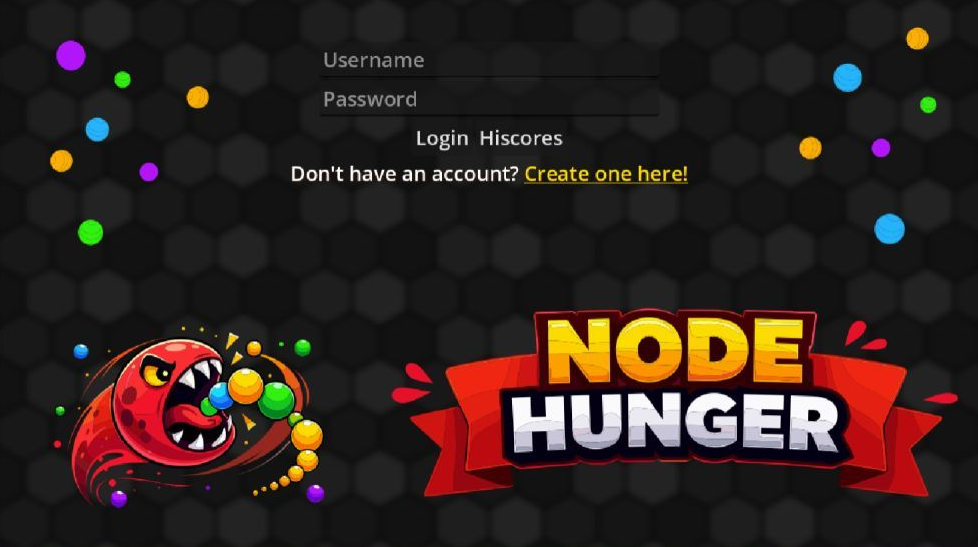
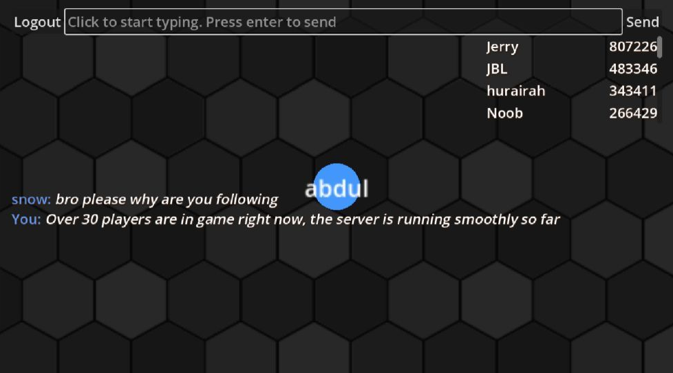
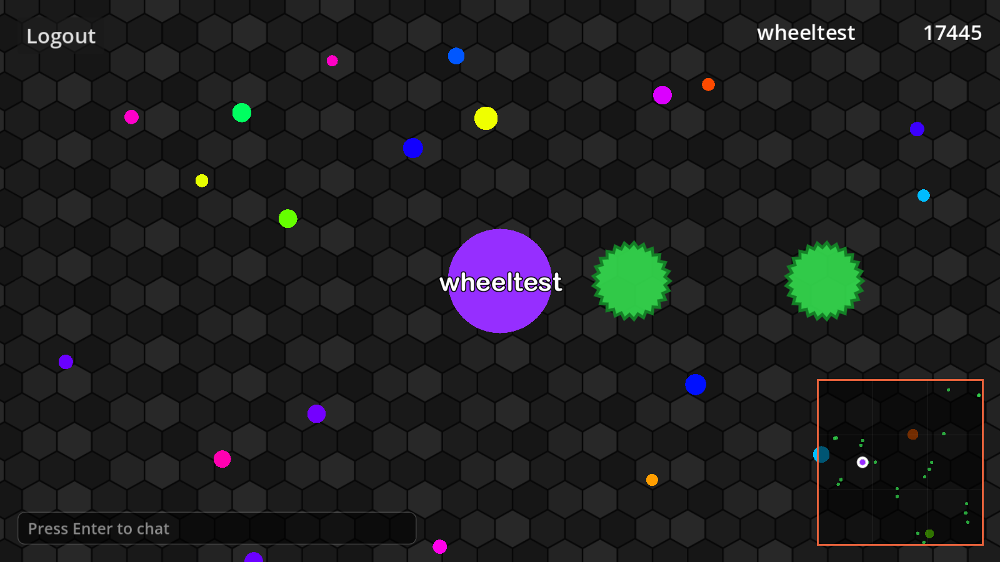
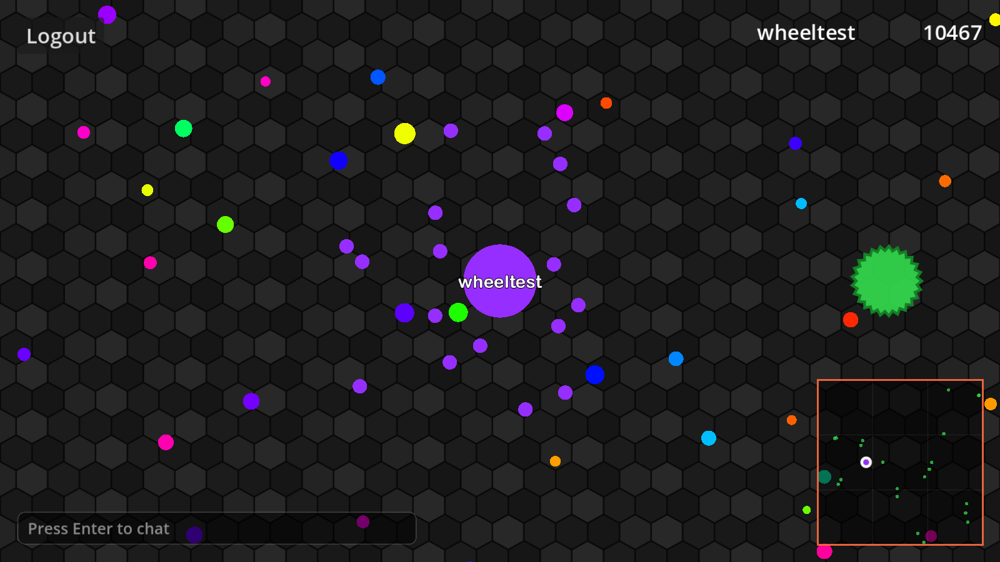
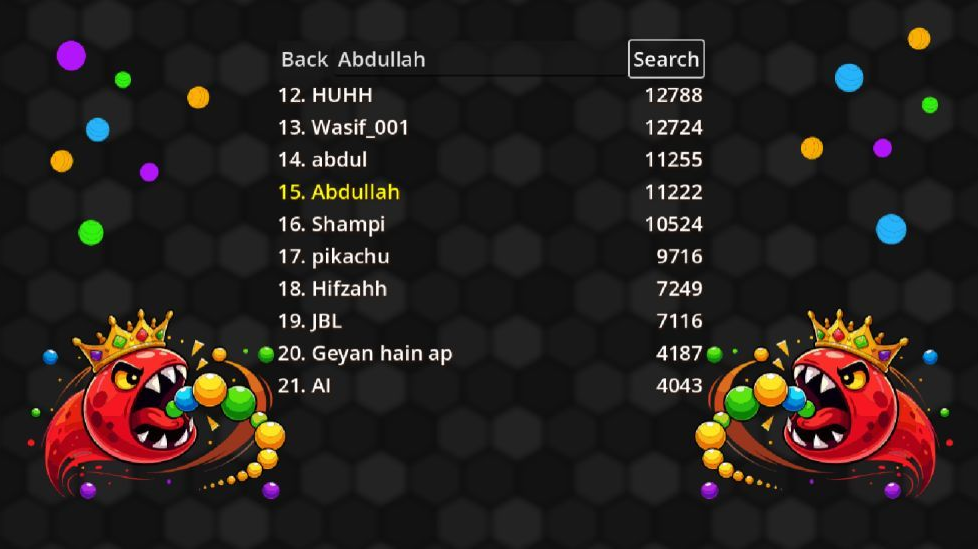

# Node Hunger server

The Go game server for **Node Hunger**, an Agar.io-style multiplayer browser game.

**Play it:** https://nodehunger.bugblazer.dev

It's the year 2100 and the global RAM shortage is at its worst. Every player is an AI node, hungry
for memory: eat the RAM spores scattered around the map, grow, and once you're big enough, eat other
nodes for their compute too.



## Gameplay

- **Move** with the mouse. Eat spores to grow, and eat nodes smaller than two thirds of your mass.
- **W** throws a bit of your mass towards the mouse. Hold it to keep throwing.
- **Viruses** are the green spiky circles. Small nodes can hide under them, but a node big enough to
  cover one bursts: 40% of its mass flies off as spores that anyone nearby can grab.
- **Feed a virus** (throw mass into it) seven times and it shoots out a new virus the way you were
  aiming, which bursts the first big node in its path.
- **Enter** opens the chat, Enter again sends.
- A live leaderboard and a minimap while you play, and an all-time high score table with search.



| Feeding a virus until it shoots | Bursting on a virus |
| --- | --- |
|  |  |



## How it works

- **One hub, one goroutine per job.** A central hub owns the connected clients and fans messages out.
  Each client has a read pump, a write pump and an inbox processed by a single goroutine, which is the
  only thing that touches that client's state. Viruses are owned by one more goroutine in the hub.
- **A state machine per client:** `Connected` (login and sign-up), `InGame` and `BrowsingHiscores`.
  Each state only handles the messages that make sense for it.
- **Protocol Buffers over WebSockets.** Every message is defined once in
  [`proto/packets.proto`](proto/packets.proto); the Go code here and the GDScript in the client are
  generated from it.
- **The server checks every claim.** Clients send only the direction they want to move in, and the
  server moves them 20 times a second. When a client says it ate a spore or another node, the server
  checks that the target exists, is within reach, and (for nodes) is small enough before anything
  happens.
- **Interest management.** Players you can see get every position update (20 a second); players far
  away get two a second. At 100 players this cut total traffic from 8.5 MB/s to 1.8 MB/s.
- **Database.** Accounts and best scores are stored in [Turso](https://turso.tech) (hosted SQLite) when
  `TURSO_DATABASE_URL` is set, or in a local SQLite file otherwise. Queries are written in plain SQL
  and turned into typed Go code with [sqlc](https://sqlc.dev).

## Running it locally

You need Go 1.23 or newer.

```bash
go run ./cmd
```

It listens on port 8080 and creates `db.sqlite` in the current folder. Settings are read from `.env`
(committed, no secrets) and `.env.local` (git-ignored):

| Variable | What it does |
| --- | --- |
| `PORT` | Port to listen on (default 8080) |
| `DATA_PATH` | Folder for the local SQLite database |
| `TURSO_DATABASE_URL` | Use this Turso database instead of the local file |
| `TURSO_AUTH_TOKEN` | Token for the Turso database. Keep it in `.env.local` or the host's environment |

Endpoints: `/ws` for the game, `/health` for uptime checks.

## Tests and load testing

```bash
go test ./...
```

The tests cover unique client IDs under concurrency, which position updates reach near and far
players, virus bursting and shooting, and an end-to-end run where 20 players sign up at once, play
and all leave together.

[`cmd/loadtest`](cmd/loadtest) runs bots that register, log in, steer randomly and send timestamped
chat, then reports traffic, chat delay and how often each bot hears from nearby players:

```bash
go run ./cmd/loadtest -url ws://localhost:8080/ws -n 30 -d 15s
```

Add `-burst` to sign all the bots up at the same moment.

## Changing the protocol

Edit `proto/packets.proto`, then regenerate the Go code:

```bash
protoc --proto_path=proto --go_out=. --go_opt=paths=import proto/packets.proto
```

The client's `packets.gd` is generated from the same file with
[Godobuf](https://github.com/oniksan/godobuf).

## Related repositories

- [nodeHunger](https://github.com/bugblazer/nodeHunger): the Godot client source.
- [node_hunger_client](https://github.com/bugblazer/node_hunger_client): the web build that's
  deployed at nodehunger.bugblazer.dev.

Built by [bugblazer](https://bugblazer.dev).
